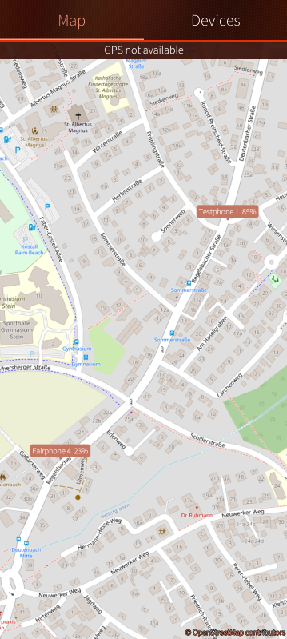
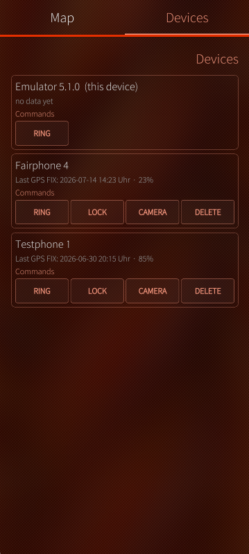
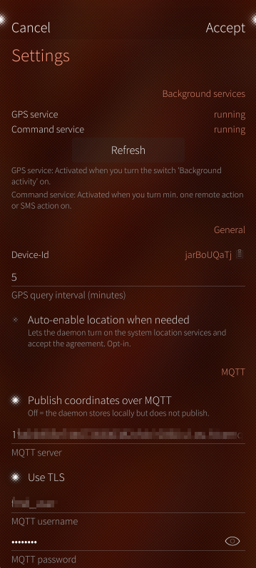

<!-- markdownlint-disable MD041 -->
<p align="center">
    <a href="https://github.com/Dominik-h-hub/harbour-find-my-device/actions/workflows/build.yaml"></a>
    <br>
    
    <br>
    <b>Radar App for Sailfish OS </b><br>
    <b>(Find my Device)</b>
</p>

## Introduction

This app is a native Find-My-Device App for Sailfish OS. It allows you to locate your device on a map, and send some commands to it remotely. 
The full documentation is available under [docs/](docs/)

<p align="center">
<a href="https://openrepos.net"></a>
<a href="https://github.com/Dominik-h-hub/harbour-find-my-device/releases"></a>
<!-- <a href="https://store.jolla.com"></a> -->
</p>
## Features

- Locate your device on a map
- Publish your device's GPS coordinates via MQTT (optional - use your own MQTT broker or free public broker)
- Send commands to your device remotely via MQTT (optional - use your own MQTT broker or free public broker):
  - RING / STOP_RING - Make your device ring for 60 seconds
  - LOCK - Lock your device into lock-screen
  - GPS - get current GPS coordinates and publish via MQTT
  - CAMERA - Take a picture with your front- or back-camera and sent it you a preconfigured webdav upload folder
  - DELETE - Wipe your userdata from your device (/home/<defaultuser | nemo>) - This is NOT a factory reset.
- Send commands to your device via SMS:
  - RING / STOP_RING - Make your device ring for 60 seconds
  - LOCK - Lock your device into lock-screen
  - GPS - get current GPS coordinates and reply to sender via SMS (ATTENTION: SMS costs may apply)
  - CAMERA - Take a picture with your front- or back-camera and sent it you a preconfigured webdav upload folder
  - DELETE - Wipe your userdata from your device (/home/<defaultuser | nemo>) - This is NOT a factory reset.
- Add other Sailfish-OS Devices to your Radar map (need Radar-App installed, MQTT configured and on same MQTT broker)
- Settings: Enable/Disable single Commands, SMS, MQTT, background-activities, etc.
- Add TOTP secret to other trusted devices for remote access via SMS
- Generate Fallback-TOTP codes for remote access via SMS
- Add own Openstreetmap-tileserver key for scrollable map (optional - free account at geoapify.com needed)

  

For more screenshots, see [docs/images/](docs/images/) in the GitHub repository.

## Security Information

General: This is not a Spy-App: Each remote action will be sent as a notification to the device. Even failed commands will be sent as a notification to the device.

- MQTT:
  - To send Commands via MQTT you need to configure a MQTT broker and a username/password for authentication.
  - Commands needs to be send with valid HMAC secret (one-time-token) based on your configured PIN from the settings. Example: {"cmd": "RING", "token": "29dd05e89e5ac143"}
  - Every single command needs to be activated in the settings. If a command is disabled, it will not be executed.
- SMS:
  - To send Commands via SMS you need to configure a TOTP secret at another trusted device
  - Whitelist: Only SMS from whitelisted phone numbers will be accepted. You can add trusted phone numbers to the whitelist in the settings.
  - Commands needs to be send with valid TOTP code based on your configured PIN from the settings. Example: "RING 123456"
  - Every single command needs to be activated in the settings. If a command is disabled, it will not be executed.

## Technical Information

- QT-Version 5.6.3
- Tested Emulator 5.0.0.62
- Tested Fairphone 4 5.0.0.62
- Tested Emulator 5.1.0.11

## Contributing to the project

We are happy about any contribution to the project, whether it's bug fixes, new features, translations or documentation.

## Localization

All language/regional translations are managed here [translations/*](translations/) in the GitHub repository.
If you want to contribute translations, please submit them as pull requests against the `translations/harbour-find-my-device-{language-code}.ts` files directly.

- Go to folder translations.
- If there is a file with your language code, click on it and select the edit icon
- If not:
  - Click on harbour-find-my-device.ts file
  - Select copy icon (Copy raw file)
  - Go back, click Add file -> Create new file
  - Enter harbour-find-my-device-xx.ts replacing xx with your language code as the name. For example, de for german
  - Paste the copied file in the new file's contents
- replace:

  ```xml
  <source>Save</source>
  <translation type="unfinished"></translation>
  ```

  with the correct translation for your language (remove "type="unfinished" and add the translation in between the <translation> tags). For example, for german:

  ```xml
  <source>Save</source>
  <translation>Speichern</translation>
  ```

Thanks for your consideration and contribution!

## Trademark Disclaimer

Sailfish OS and the Sailfish OS logo are trademarks of Jolla Group Ltd.
