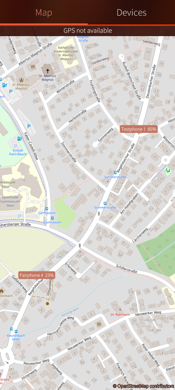
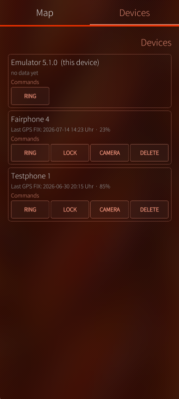
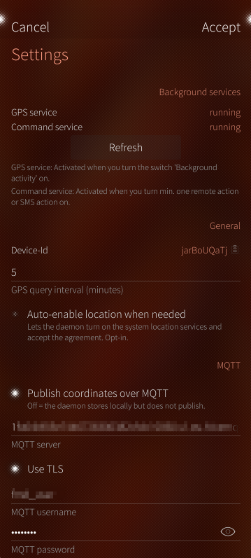

<!-- markdownlint-disable MD041 -->
<p align="center">
    <a href="https://github.com/Dominik-h-hub/harbour-find-my-device/actions/workflows/build.yaml"></a>
    <br>
    
    <br>
    <b>Radar App for Sailfish OS </b><br>
    <b>(Find my Device)</b>
</p>

## Introduction

Radar (Find My Device) is a native find-my-device app for Sailfish OS: see your device's last position on a map and control it remotely via MQTT or SMS — fully self-hosted, no Google or cloud account involved.

For the app usage see the [User Guide](docs/USER-GUIDE.md), for technical internals (daemons, logs, MQTT topics, token generation) see the [Technical Infos](docs/TECHNICAL-INFOS.md).

<p align="center">
<a href="https://openrepos.net/content/domih/radar-find-my-device"></a>
<a href="https://github.com/Dominik-h-hub/harbour-find-my-device/releases"></a>
<a href="https://store.jolla.com"></a>
<!-- <a href="https://sailfishos-chum.github.io/"></a> -->

</p>

## Features

- **Locate your device** on an OpenStreetMap map (optional free Geoapify key needed for a zoomable map)
- **Track other Sailfish OS devices** on the same map (Radar app installed + same MQTT broker)
- **Publish your device's GPS position** via MQTT (optional — use your own or a free public broker)
- **Remote commands**, via MQTT and/or SMS:
  - RING / STOP_RING — ring the device for 60 seconds
  - LOCK — lock the device into the lock screen
  - GPS — report the current position (published via MQTT, or replied by SMS — SMS costs may apply)
  - CAMERA — take a photo (front or back camera) and upload it to your WebDAV folder
  - DELETE — wipe all user data (`/home/<defaultuser | nemo>`) and reboot — NOT a factory reset
- **Everything is opt-in**: each command, MQTT, SMS and background tracking can be enabled/disabled individually in the settings
- **Translations**: EN, DE, SV

## Two Packages: App + Background Service

Since v1.2 the project ships as two RPMs (required for Jolla Store / Harbour
compliance):

- **`harbour-find-my-device`** — the app itself, fully sandboxed (Sailjail).
  Works standalone: map, device management, foreground position updates while
  the app is open, TOTP/backup codes.
- **`harbour-find-my-device-daemon`** — the background services (remote
  commands via MQTT/SMS, background tracking, privileged helper for
  reboot/SMS). Not sandboxed, therefore not in the Jolla Store. The app RPM
  bundles it: the Settings page offers a one-tap install through the system
  installer. On OpenRepos and SailfishOS:Chum it can also be installed as a
  separate package.

  

For more screenshots, see [docs/images/](docs/images/) in the GitHub repository.

## Example Client App

An example client app for home use (Flask + Leaflet map + command buttons) is available under [docs/examples/](docs/examples/).

## Security Information

This is not a spy app: every remote action — even a failed one — shows a notification on the device. All commands are disabled by default; every single command must be enabled in the settings, a disabled command is never executed.

- MQTT:
  - Commands require broker authentication (username/password) plus a one-time HMAC token derived from your PIN. Example: `{"cmd": "RING", "token": "29dd05e89e5ac143"}`
- SMS:
  - Commands are only accepted from whitelisted phone numbers (configured in the settings).
  - Each command SMS requires a TOTP code (authenticator app enrolled on a second device) or a one-time backup code, both generated in the settings. Example: `RING 123456`

## Technical Information

- Qt 5.6.3 (Sailfish OS Silica UI) + Python 3 backend/daemons
- Two-RPM model: sandboxed store app + separate daemon package (see [Technical Infos](docs/TECHNICAL-INFOS.md))
- Tested on:
  - Fairphone 4 - Sailfish OS 5.0.0.62
  - Emulator - Sailfish OS 5.0.0.62, 5.1.0.11

### Building

The version is maintained **only** in `rpm/harbour-find-my-device.spec`
(`Version:` / `Release:`); the daemon spec inherits it at build time and both
packages write a `VERSION` file that app and daemons read at runtime. When
building locally with the Sailfish SDK, disable the SDK's automatic
git-describe versioning so the spec version applies: `sfdk config
no-fix-version` (or `mb2 --no-fix-version`). Release tags must match the spec
version (`v<Version>-<Release>-release`) - the release CI enforces this.

CI build order: the noarch daemon RPM is built first (plain `rpmbuild`, no
compilation), then each app build picks it up from `daemon-rpm/RPMS/` and
embeds it under `/usr/share/harbour-find-my-device/daemon/`. The app RPM is
gated by the official [sdk-harbour-rpmvalidator](https://github.com/sailfishos/sdk-harbour-rpmvalidator).

## Contributing to the project

We are happy about any contribution to the project, whether it's bug fixes, new features, translations or documentation.

## Localization

All language/regional translations are managed here [translations/*](translations/) in the GitHub repository.
If you want to contribute translations, please submit them as pull requests against the `translations/harbour-find-my-device-{language-code}.ts` files directly.

- Go to folder translations.
- If there is a file with your language code, click on it and select the edit icon
- If not:
  - Click on harbour-find-my-device.ts file
  - Select copy icon (Copy raw file)
  - Go back, click Add file -> Create new file
  - Enter harbour-find-my-device-xx.ts replacing xx with your language code as the name. For example, de for german
  - Paste the copied file in the new file's contents
- replace:

  ```xml
  <source>Save</source>
  <translation type="unfinished"></translation>
  ```

  with the correct translation for your language (remove "type="unfinished" and add the translation in between the <translation> tags). For example, for german:

  ```xml
  <source>Save</source>
  <translation>Speichern</translation>
  ```

Thanks for your consideration and contribution!

## License

This project is licensed under the Apache License 2.0 - see [LICENSE](LICENSE).

## AI Information

AI (Claude) was used to:

- Generate comments in the code
- Generate technical documentation
- perform initial POC on Fairphone 4 to find out right d-bus and API calls for this project
- Code review and refactoring
- Debugging and testing support

## Trademark Disclaimer

Sailfish OS and the Sailfish OS logo are trademarks of Jolla Group Ltd.
