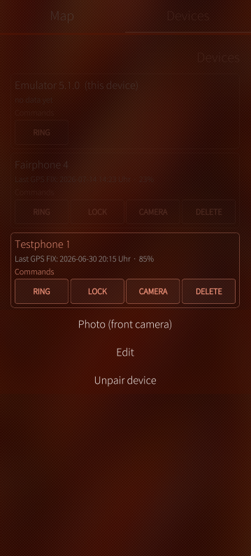
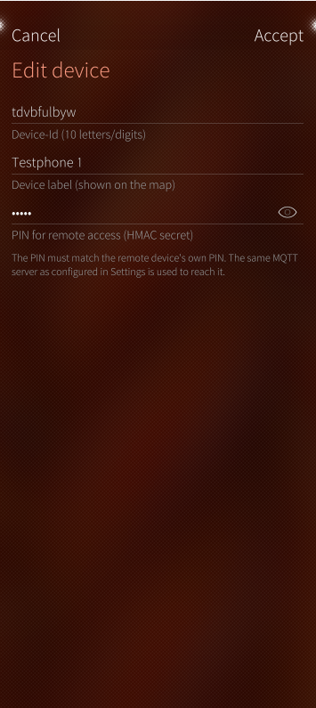
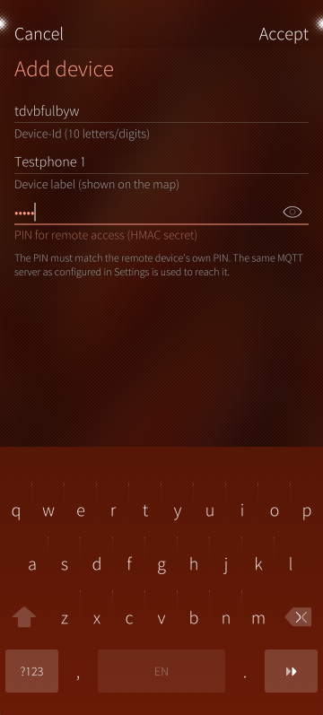
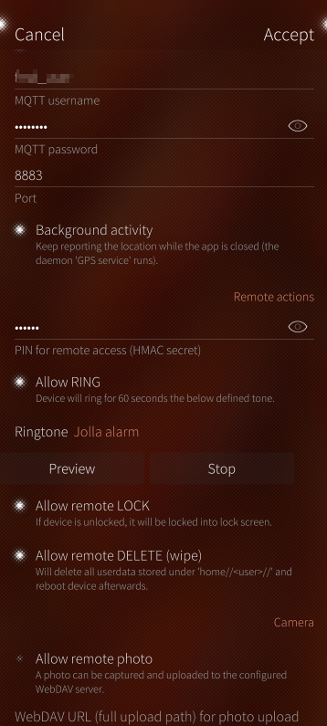
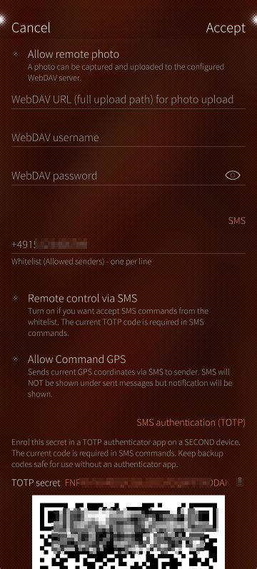
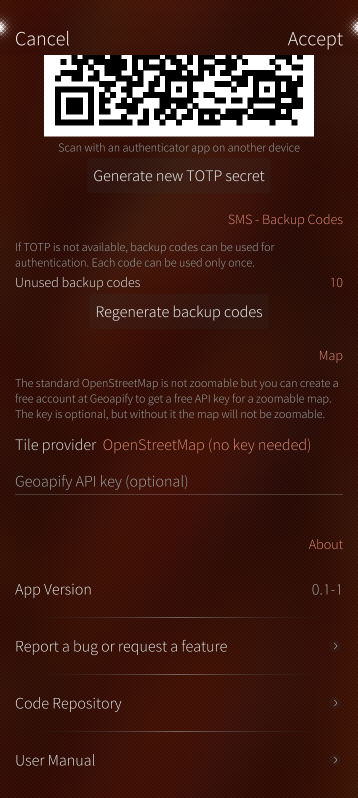

# Radar App - User Guide

## Introduction

Radar (Find My Device) is a native Sailfish OS application that allows you to locate your device on a map and send commands to it remotely — via MQTT and/or SMS, fully self-hosted.

This guide describes the app usage page by page. For a feature overview see the [README](../README.md), for technical internals (daemons, logs, MQTT topics, token generation) see the [Technical Infos](TECHNICAL-INFOS.md).

## Getting Started (Pairing two devices)

To track and control another Sailfish OS device, both devices need the Radar app and the same MQTT broker:

1. Install the Radar app on both devices.
2. On both devices, configure the same MQTT broker in the settings and enable "Publish coordinates over MQTT".
3. On the device you want to control: set a "PIN for remote access" in the settings and enable the commands you want to allow (RING, LOCK, CAMERA, DELETE).
4. Note the Device-Id of the other device (Settings → General → Device-Id, tap to copy).
5. On your device: open the Devices tab, pull down, select "Add device" and enter the Device-Id of the other device plus its remote PIN.

After the next GPS fix of the other device, it will appear on your map.

## Map View (Main Page)

The main page of the Radar App displays a map view where you can see the location of your device and other devices which you added in the tab "Devices".
The default OpenStreetMap map is NOT interactive. With a Geoapify tile server key (optional — free account at [geoapify.com](https://www.geoapify.com) needed, see [Settings → Map](#map)) you can tap the map to open a full-screen interactive map (zoom and scroll).

### Pull-Down Menu

If you pull down the map view, you will see a menu with the following options:

- Settings: Opens the settings page where you can configure various options for the app.
- Update map: Requests a new GPS fix for your device and refreshes the map view from the database to show the latest location of your device and any other devices you have added.

  

## Devices Page

The devices page allows you to manage the devices you want to track. You can add, edit and unpair remote devices; your own device can only be edited (label), not unpaired.

Below each device the list shows its status: the "Last GPS FIX" time and hints like "no PIN set", "wrong PIN" (authentication failed), "no response (check device id)" or "Device deleted and not reachable anymore" (after a DELETE).

You can send the following commands to a remote device (if a PIN was set for it — the button switches to STOP while the device is ringing):

- RING / STOP: Makes the device ring for 60 seconds (or stops the ringing).
- LOCK: Locks the device into the lock screen.
- CAMERA: Takes a picture with the back camera of the device and uploads it to the preconfigured WebDAV upload folder. Works only if the command is enabled on the other device.
- DELETE: Wipes the user data from the device (`/home/<defaultuser | nemo>`) — this is NOT a factory reset. Afterwards, the device will reboot and cannot be tracked anymore.

Every command is answered by the target device — the result (acknowledged / wrong PIN / disabled on target / no response) is shown as a banner and in the device status line.

  

### Long-press context menu

If you long-press on a remote device in the list, you will see a context menu with the following options:

- Photo (front camera): Takes a picture with the front camera of the device and uploads it to the preconfigured WebDAV upload folder. Works only if the command is enabled on the other device.
- Edit: Opens a dialog to edit the device's details.
- Unpair device: Removes the device from your list.

Your own device only offers "Edit" (change the label).

  
  

### Pull-Down Menu

If you pull down the devices page, you will see a menu with the following options:

- Settings: Opens the settings page where you can configure various options for the app.
- Add device: Opens a dialog page to add a new device. Enter the Device-Id (Radar app needs to be installed on the other device) and the remote PIN if you are allowed to send remote actions to the other device. Note: The other device needs to configure the same MQTT server as you did in the settings.
- Refresh: Refreshes the devices list from the database and updates the "Last GPS FIX" time and date.

  

## Settings Page

The settings page allows you to configure various options for the Radar App, including MQTT settings, SMS settings, and command permissions. You can enable or disable specific commands, set up your MQTT broker, and configure your WebDAV upload folder.

### Background services

At the top of the settings the live status of the two background daemons is shown (running / deactivated / failed), with a Refresh button:

- GPS service: Activated when you turn the switch "Background activity" on.
- Command service: Activated when at least one remote action or SMS action is turned on.

The app starts and stops the daemons automatically whenever you save the settings — this section is just for checking that everything runs as expected.

### General

- Device-Id: The unique id of your device — this is what you enter on another device to pair it with yours. Tap the row to copy the id to the clipboard.
- GPS query interval (minutes): Sets the interval for GPS position updates.
- Auto-enable location when needed: If enabled, the app will automatically turn on the system location services (and accept the agreement) when needed.

  

### MQTT

- Publish coordinates over MQTT: If enabled, the app will publish your device's GPS coordinates to the configured MQTT broker. If disabled, positions are only stored locally.
- MQTT server: The address of your MQTT broker (e.g., `broker.example.com`)
- Use TLS: If enabled, the app will use TLS/SSL for secure communication with the MQTT broker.
- MQTT username: The username for your MQTT broker
- MQTT password: The password for your MQTT broker
- Port: The port number for your MQTT broker (default is 1883, or 8883 when TLS is enabled)
- Background activity: If enabled, the location keeps being reported while the app is closed (the "GPS service" daemon runs). While it is off, the running app polls instead.

  

### Remote actions

- PIN for remote access (HMAC secret): The PIN of YOUR device — anyone who wants to send remote commands to your device must enter this PIN when adding your device on their phone. It is the basis for the HMAC token generation (see [Technical Infos](TECHNICAL-INFOS.md#command-authentication-hmac-token)).
- Allow RING: If enabled, the RING command can be sent to your device remotely. You can choose the ringtone as well (with preview).
- Allow remote LOCK: If enabled, the LOCK command can be sent to your device remotely.
- Allow remote DELETE (wipe): If enabled, the DELETE command can be sent to your device remotely. User data will be wiped and the device will reboot.

### Camera

- Allow remote photo: If enabled, the CAMERA command can be sent to your device remotely. Photos will be uploaded to the configured WebDAV folder.
- WebDAV URL: The URL of your WebDAV folder where photos taken by the CAMERA command will be uploaded. Use the full upload path, e.g., `https://webdav.example.com/uploads/`
- WebDAV username: The username for your WebDAV folder
- WebDAV password: The password for your WebDAV folder

  

### SMS

- Whitelist (Allowed senders): A list of phone numbers that are allowed to send remote commands via SMS. Only commands from these numbers will be accepted. Enter one number per line (national and international formats of the same number both match).
- Remote control via SMS: If enabled, the app will accept remote commands via SMS from whitelisted numbers. Each command requires a TOTP code or a one-time backup code (see the next two sections).
- Allow Command GPS: If enabled, the GPS command can be sent to your device via SMS — the current coordinates are sent back by SMS to the sender (SMS costs may apply; the reply does not show up under sent messages, but a notification is shown).

A command SMS is `KEYWORD [front|back] CODE`, for example `RING 123456` or `CAMERA front 123456` — see the [Technical Infos](TECHNICAL-INFOS.md#sms-command-format) for details.

### SMS authentication (TOTP)

SMS commands are authenticated with a TOTP code (like a login second factor):

- TOTP secret: Enrol this secret in a TOTP authenticator app on a SECOND device — either scan the shown QR code or tap the secret to copy it. The current 6-digit code of the authenticator app is the `CODE` required in every command SMS.
- Generate new TOTP secret: Creates a new secret (the old one becomes invalid — re-enrol your authenticator app afterwards).

### SMS - Backup Codes

If TOTP is not available, backup codes can be used for authentication instead. Each code can be used only once.

- Unused backup codes: Shows how many backup codes are left.
- Regenerate backup codes: Generates a fresh set of backup codes and displays them — store them in a safe place.

### Map

- Tile provider: Choose between "OpenStreetMap (no key needed)" (static map) and "OpenStreetMap Geoapify".
- Geoapify API key: Your personal Geoapify key for the map view. This is optional, but required for the full-screen interactive (zoomable) map.

  

### About

Shows the app version and links to report a bug or feature request, the code repository and this user manual.

## Cover Actions

The app cover shows your device label, the time and date of the last GPS fix and the current battery level. With the refresh cover action you can request a new GPS fix — it will be stored in the database and (if enabled) published via MQTT.
